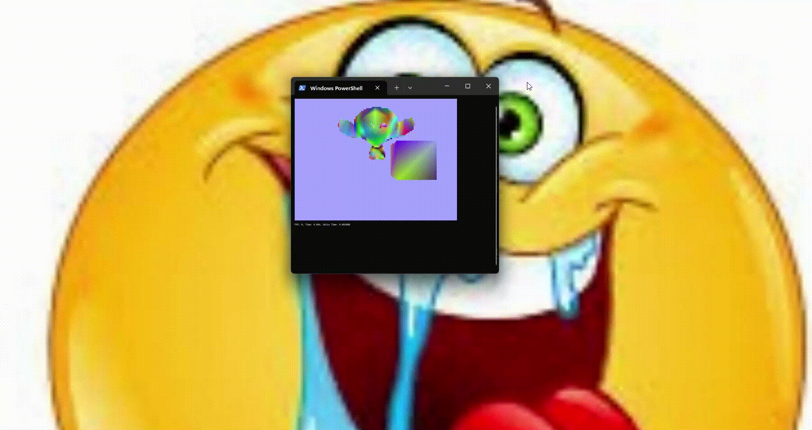

# TerminalRendererC
a little 3d terminal software renderer i've made in a few days with c, it's alright ig.

make sure to build like this:
'gcc -Isrc main.c src/*.c -o main'

IGNORE the fact that every file in src is 5 kb while mesh.c is 110 kb.
